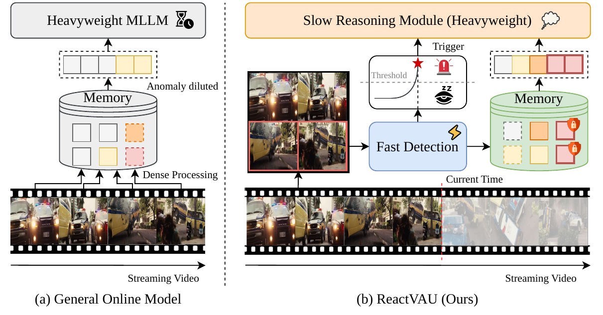
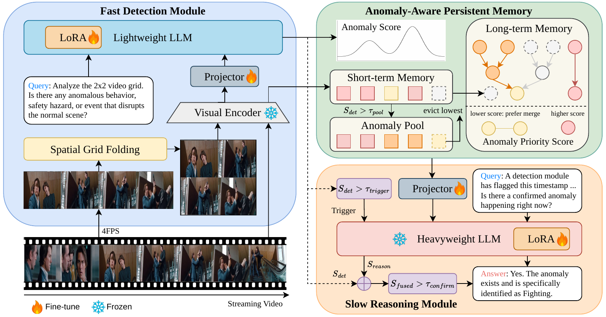

# ReactVAU: A Slow-Fast Decoupled Framework for Streaming Video Anomaly Understanding

<p align="center">
  <a href="https://huiyuiui.github.io/ReactVAU/">Project Page</a>
</p>

ReactVAU is a Slow-Fast Decoupled Framework for causal, streaming Video Anomaly Understanding (VAU). It separates continuous lightweight anomaly monitoring from heavyweight semantic reasoning, so normal video streams do not repeatedly invoke a large multimodal language model.

<p align="center">
  
</p>

## Introduction

Conventional VAU systems commonly require access to the complete video, which conflicts with real deployment where future frames are unavailable. ReactVAU operates causally: it observes only the current and past stream, produces one Fast-module score per second by default, and invokes the Slow module only for suspicious intervals.

The framework consists of three components:

1. **Fast Detection Module.** PaliGemma2-3B applies Spatial Grid Folding (SGF): four frames sampled at 4 FPS are folded into one 2x2 grid and scored through the `Yes`/`No` logits.
2. **Anomaly-Aware Persistent Memory (AAPM).** The Fast anomaly score protects suspicious evidence during memory compression through the Anomaly Priority Score (APS), the Anomaly Pool, and dense Real-Time Perception for triggered intervals.
3. **Slow Reasoning Module.** A StreamForest-7B backbone remains dormant during normal streaming. When triggered, it verifies the event from the AAPM memory and produces a semantic explanation.

<p align="center">
  
</p>

## Preparation

### Environment

ReactVAU is tested on Linux with Python 3.10 and CUDA-enabled GPUs. Create an environment, install the PyTorch build matching your CUDA version, then install the release dependencies.

```bash
conda create -n ReactVAU python=3.10
conda activate ReactVAU

# Install the PyTorch build matching your CUDA version first.
pip install -r requirements.txt
```

Alternatively, create the supplied Conda environment with `conda env create -f environment.yml`. HIVAU metric evaluation requires a Java runtime for METEOR.

### Paths and checkpoints

All maintained shell scripts load [`scripts/config/paths.sh`](scripts/config/paths.sh). Configure local paths before running the code:

```bash
cp scripts/config/paths.sh scripts/config/paths.local.sh
```

Set the dataset and checkpoint roots in `paths.local.sh`. Download the released ReactVAU adapters and required backbone assets, then arrange them as follows:

```text
ckpt/
  paligemma2-3b-mix-448/                         # PaliGemma2 base checkpoint
  extracted_weights/
    streamforest_vision_encoder_with_prefix.safetensors
  paligemma2-3b-vad-lora-384-combined-binary/    # Stage-1 Fast module adapter
    training_384/
  StreamForest-Qwen2-7B_Siglip/                  # StreamForest backbone
  hivau-finetune/
    <reactvau-checkpoint>/                        # Stage-2 ReactVAU adapter
```

### Checkpoints

Download the required checkpoints and place them at the listed location, or override the corresponding variable in `paths.local.sh`.

| Component | Download | Default location | Required files |
| --- | --- | --- | --- |
| PaliGemma2-3B base model | Official release | `ckpt/paligemma2-3b-mix-448/` | Base-model files from the official release |
| StreamForest vision encoder | ReactVAU release | `ckpt/extracted_weights/` | `streamforest_vision_encoder_with_prefix.safetensors` |
| ReactVAU Fast Module | ReactVAU release | `ckpt/paligemma2-3b-vad-lora-384-combined-binary/training_384/` | LoRA adapter and configuration |
| StreamForest-7B base model | Official release | `ckpt/StreamForest-Qwen2-7B_Siglip/` | Base-model files required by StreamForest |
| ReactVAU Slow Module | ReactVAU release | `ckpt/hivau-finetune/<reactvau-checkpoint>/` | Stage-2 adapter/projector weights and configuration |

### Datasets

ReactVAU uses UCF-Crime and XD-Violence for anomaly detection, and HIVAU-70K for anomaly understanding. Obtain all datasets from their official sources and follow their licenses. Set `HIVAU_ROOT` to a directory containing:

```text
HIVAU-70k/
  videos/
    ucf-crime/
    xd-violence/
  instruction/
    detection/
    merge_instruction_test_final.jsonl
  raw_annotations/
    ucf_database_train.json
    xd_database_train.json
    ucf_database_test_anno.txt
    xd_database_test_anno.txt
```

The training metadata must retain the video paths expected by the grid-data generator:

```text
HIVAU-70k/
  videos/
    ucf-crime/videos/train/<video_name>.mp4
    xd-violence/videos/train/<video_name>.mp4
```

HIVAU training annotations are not distributed with this repository. Obtain the HIVAU instruction files from the dataset provider, then set the local annotation path in `paths.local.sh`:

```bash
export HIVAU_TRAIN_JSON="/path/to/HIVAU-70k/instruction/train.json"
```

The required PaliGemma score file is generated during the Stage 2 preparation step below.

## Evaluation and Inference

All commands below are run from the repository root after `paths.local.sh` has been configured.

### Single-video inference

```bash
source scripts/config/paths.sh

python eval_utils/hivau/run_reactvau_vau.py \
  --video /path/to/video.mp4 \
  --question "Please describe the events in this video in detail." \
  --pg-model-path "${PALIGEMMA_MODEL_PATH}" \
  --pg-lora-path "${PALIGEMMA_LORA_PATH}" \
  --pg-image-size 384 \
  --pg-sf-weights "${PALIGEMMA_SF_WEIGHTS}" \
  --pg-vision-layer -2 \
  --sf-model-base "${STREAMFOREST_MODEL_BASE}" \
  --sf-model-path "${REACTVAU_CHECKPOINT_PATH}" \
  --context-mode none \
  --anomaly-threshold 0.4 \
  --enable-memory-enhancement \
  --output-dir inference_results
```

### Streaming VAD evaluation

Evaluate the Fast module alone or the full ReactVAU pipeline on UCF-Crime or XD-Violence:

```bash
DATASET=ucf-crime TEST_MODE=true TEST_SAMPLES=10 \
  bash scripts/eval/run_eval_paligemma_detect.sh

DATASET=ucf-crime TEST_MODE=true TEST_SAMPLES=5 \
  bash scripts/eval/run_eval_reactvau_detect.sh
```

Set `TEST_MODE=false` for a full benchmark run. The full VAD pipeline performs Fast scoring and AAPM updates continuously, then wakes the Slow module only after a threshold crossing. The supplied script contains the paper-aligned trigger and score-fusion settings.

### HIVAU-70K understanding evaluation

```bash
TEST_MODE=true TEST_SAMPLES=20 \
  bash scripts/eval/run_eval_reactvau_hivau.sh
```

For the paper-aligned VAU protocol, keep `CONTEXT_MODE=none`, `SF_ENHANCE_MEMORY=true`, and `ANOMALY_THRESHOLD=0.4`. The Fast scores shape AAPM internally; they are not inserted into the final language question.

## Training

ReactVAU is trained in two stages. Before Stage 2, precompute the Stage-1 detector scores for every HIVAU training video so the same score signal drives AAPM during training and inference.

### Stage 1: Construct the grid-image dataset

The Fast Detection Module is trained on a combined binary dataset constructed from the UCF-Crime and XD-Violence training splits. Each sample contains four temporally ordered frames folded into 2x2 grid. The generator samples anomalous intervals as positives, normal intervals in anomalous videos as hard negatives, and UCF-Crime normal videos as easy negatives. It balances these groups with the default `1:1:1` positive:hard-negative:easy-negative ratio.

To validate the dataset layout on a small subset:

```bash
source scripts/config/paths.sh
VAD_TRAIN_ROOT="${REACTVAU_ROOT}/vad/vad_data/paligemma_train_smoke" \
  bash scripts/gen_data/gen_train_data.sh --test-mode --test-samples 5
```

Then construct the full training set:

```bash
bash scripts/gen_data/gen_train_data.sh
```

The default output directory is `vad/vad_data/paligemma_train/` (or `VAD_TRAIN_ROOT` if overridden):

```text
vad/vad_data/paligemma_train/
  train_images/                         # 384x384 PNG grids
  ucf_crime_train_binary.json
  xd_violence_train_binary.json
  combined_train_binary.json            # input to the released Stage-1 script
  training_stats.json
```

### Stage 1: Train the Fast Detection Module

```bash
bash scripts/train/finetune-vad/train_paligemma_vad_384.sh
```

### Precompute Fast-module scores for Stage 2

```bash
source scripts/config/paths.sh
python scripts/precompute/precompute_pg_scores.py --resume
```

### Stage 2: Train the Slow Reasoning Module

```bash
bash scripts/train/finetune-hivau/finetune_reactvau.sh
```

The training scripts are configured for a single RTX 4090. Their path and output variables can be overridden through `scripts/config/paths.local.sh` or the command line.

## Citation

```bibtex
@inproceedings{chen2026reactvau,
  title     = {ReactVAU: A Slow-Fast Decoupled Framework for Streaming Video Anomaly Understanding},
  author    = {Chen, Chia-Hui and Yeh, Shih-Ying and Yang, Fu-En and Chen, Min-Hung and Lai, Shang-Hong},
  booktitle = {European Conference on Computer Vision},
  year      = {2026}
}
```

## Acknowledgements

This repository builds on PaliGemma, LLaVA-style multimodal training infrastructure, and StreamForest for streaming video memory. We use the HIVAU-70K benchmark introduced by Holmes-VAU, together with UCF-Crime and XD-Violence for detection training and evaluation. Please cite the corresponding work when using their models, code, or data.

## Licenses

Copyright © 2026, NVIDIA Corporation. All rights reserved.

This work is made available under the NVIDIA Source Code License-NC. Click [here](LICENSE) to view a copy of this license.
